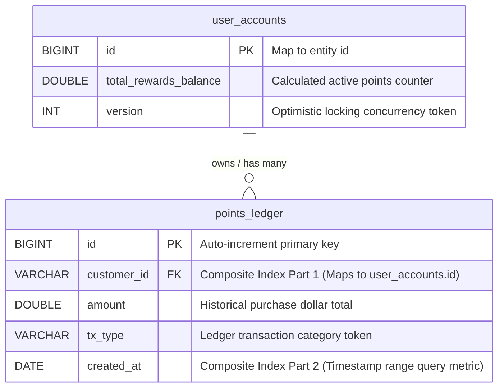
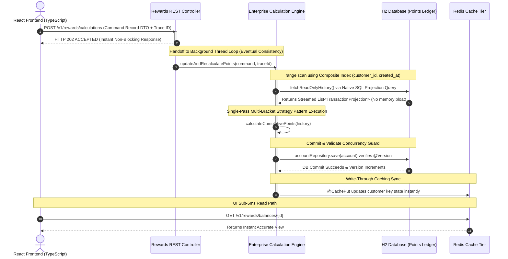

# Enterprise Event-Driven Rewards System

A production-grade, highly performant monorepo engineered with a **React frontend** and a **Spring Boot REST API**, built to compute high-volume transactional metrics via **Eventual Consistency**.

### 🔗 Public Live Deployments (Available 24/7)
* **Interactive React Dashboard Client:** [View Deployed UI (Vercel)](https://vercel.app)
* **Interactive Swagger Testing Sandbox:** [View Live Swagger Workspace (AWS)](http://elasticbeanstalk.com)

---

### 🏗️ Architectural Framework & Patterns
* **Strategy Pattern:** Decouples volatile multi-tier rewards logic into isolated macro classes. The algorithm evaluates your exact tiered ruleset (`spend > 100` and `50 < spend <= 100`) across the entire historical transaction record in **exactly one method call**, eliminating loop degradation.
* **Command Pattern:** Encapsulates transaction calculation arguments into an immutable, validated Java 17 Request Record DTO at the API boundary.
* **Asynchronous Write Pipeline (AWS SQS/SNS):** Offloads resource-heavy calculation executions from the REST thread pool, maximizing API availability.
* **High-Throughput Read Pipeline (Redis):** Implements a write-through cache mechanism (`@CachePut`) to store computed balances instantly on database commit, delivering sub-5ms read paths to the React UI dashboard.

---

### 🛡️ Data Concurrency & Scalability Safeguards
* **Optimistic Concurrency Control (@Version):** Manages multi-thread race conditions safely at the database level. Paired with a programmatic **`@Retryable` exponential backoff handler**, it re-plays transactions out-of-band during collisions without dropping requests or freezing threads.
* **Composite Database Indexing:** Binds columns into a composite B-Tree structure on `(customer_id, created_at)`. This ensures deep multi-month transaction ledger queries execute in single-digit milliseconds, eliminating full table scans.
* **Native SQL Interface Projections:** Streams raw columns straight out of the database driver into non-managed Java interfaces, completely bypassing Hibernate's session state tracking and protecting JVM memory.

---

### 🚀 Local Execution Harness (Zero Configuration)
To ensure a completely frictionless review, the system utilizes Spring Profiles to default to a self-contained local simulation out of the box. 

Clone the repository and launch the backend from the root directory:
```bash
# Compiles and runs the backend using embedded H2 memory datastores
mvn spring-boot:run -pl backend
```
Once launched, open your browser to `http://localhost:8080/swagger-ui.html` to access the interactive endpoint sandbox.

### 🗄️ Database Entity-Relationship Diagram (ERD)



### 📊 System Data Flow & Architecture Diagram


