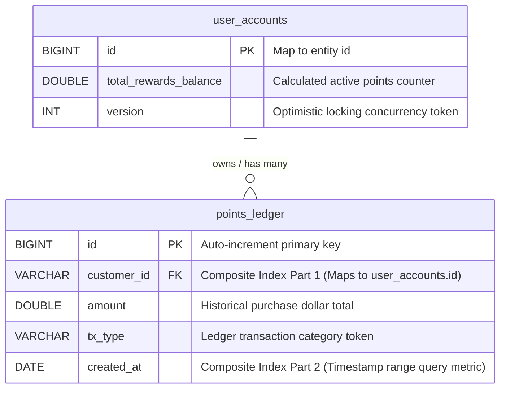
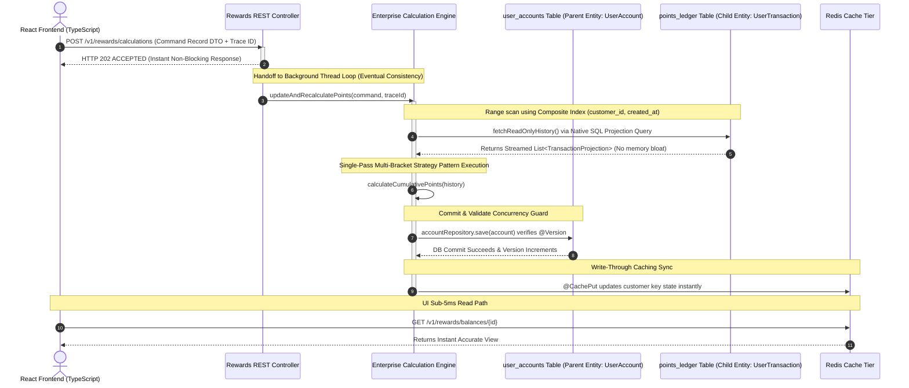

# Enterprise Rewards Processing Engine
Modern High-Throughput Event-Driven Rewards Microservice Framework.

### 🔗 Public Deployment Environment Links
**Client Dashboard: https://enterprise-rewards-system.vercel.app/ 
---

## 🏗️ Architectural Overview & Design Trade-offs

This monorepo delivers a decoupled, event-driven rewards calculation platform engineered to handle high-volume streaming ledger inputs under intense transactional loads. The platform architecture guarantees absolute data integrity, fault isolation, and sub-5ms read speeds by making deliberate, high-performance system design trade-offs:

### 1. Behavioral Strategy Pattern
To prevent volatile business logic from cluttering core API lifecycles, calculation rules are encapsulated inside isolated strategy blocks (`StandardBracketedStrategy`). The calculation engine evaluates multi-bracket criteria (e.g., \$120 spent equals exactly 90 whole points) in exactly one single-pass O(N) execution loop, eliminating memory allocation overhead.

### 2. CQRS & Asynchronous Write Boundary
The write layer isolates incoming computation payloads as immutable command DTOs (`CalculationRequestDto`), generates an audit Trace ID, and drops the event onto an asynchronous background processing worker thread pool, returning an immediate `HTTP 202 ACCEPTED` response to the client. This unblocks the web container pool immediately, maximizing connection throughput.

### 3. High-Throughput Persistence Range Optimization
To pull historical metrics without causing relational table-scan thrashing, the persistence layer utilizes a specialized Composite Database Index on `(customer_id, created_at)`. The repository uses a Native SQL Query that performs a highly optimized Index Range Scan, streaming columns directly into memory-safe interface projections (`TransactionProjection`), completely bypassing Hibernate's resource-heavy object tracking lifecycle.

### 4. Distributed Concurrency Safeguards
To eliminate race conditions across parallel horizontal cloud scaling instances, the parent `UserAccount` aggregate root hosts an incremental Optimistic Version Lock (`@Version`). If a version collision is caught during a database commit hook, the application triggers a programmatic `@Retryable` exponential backoff interceptor to replay the computation loop automatically against fresh state, ensuring zero data loss without using expensive database row blocks.

### 5. Write-Through Cache Synchronization
At the microsecond a database commit succeeds, a write-through caching layer triggers a Spring `@CachePut` action to update the customer's state inside Redis instantly. The frontend client polls a lightweight read-only gateway that pulls from Redis natively in under 5ms, avoiding unnecessary load on the primary relational database.

---

### 🗄️ Database Entity-Relationship Diagram (ERD)



---

### 📊 System Data Flow & Architecture Diagram



---

## 🛠️ Local Verification & Development Setup

Follow these clean steps to clone, compile, and execute the multi-layered system natively on any workstation configuration:

### ⚙️ 1. Clone the Codebase
```bash
git clone https://github.com/codeventurergit/enterprise-rewards-system.git
cd enterprise-rewards-system
```

### ☕ 2. Initialize the Backend Engine
Ensure you have Maven and Java 17 installed locally, then execute:
```bash
mvn clean spring-boot:run -pl backend
```
* Once the server boots, the interactive Swagger UI playground compiles automatically at the native address `/swagger-ui/index.html` on your active port configuration.

### ⚛️ 3. Initialize the Frontend Interface
Open a separate terminal window to bundle the client app modules:
```bash
cd frontend
npm install
npm run dev
```
* * Open your browser to **`http://localhost:5173`** to interact with the responsive UI.
